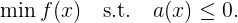
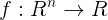

# A one-phase interior point method for nonconvex optimization

This package is the implementation of a one-phase interior point method that finds KKT points of optimization problems of the form:
<!--
$$
\min f(x)  \quad \text{s.t.} \quad a(x) \le 0.
$$
-->



where the functions  and  are twice differentiable. The one-phase algorithm also handles bound constraints and nonlinear equalities.

*Currently, the package is in development.* Although you are welcome to try it out. Please let me know if there are any bugs etc. Note that the code is generally significantly slower than Ipopt in terms of raw runtime, particularly on small problems (the iteration count is competitive). However, we recommend trying our one-phase IPM if: Ipopt is failing to solve, the problem is very large or might be infeasible.

## How to install

Open the package manager (type "]" in the console) then write

```julia
add https://github.com/ohinder/advanced_timer.jl
add https://github.com/ohinder/OnePhase.git
add NLPModels@0.15.0
add JuMP@0.21.8
add NLPModelsJuMP@0.8.2
add MathOptInterface@0.9.22
```

## How to use with JuMP

Here is a simple example where a [JuMP](http://www.juliaopt.org/JuMP.jl/0.18/JuMP) model is passed to the one-phase solver

```julia
using OnePhase, JuMP

m = Model()
set_optimizer(m, OnePhase.OnePhaseSolver)
@variable(m, x, start=-3)
@objective(m, Min, x)
@NLconstraint(m, x^2 >= 1.0)
@NLconstraint(m, x >= -1.0)

status = optimize!(m)
```

## Example using CUTEst

Install [CUTEst](http://juliasmoothoptimizers.github.io/CUTEst.jl/latest/) then run
```julia
using OnePhase, CUTEst
nlp = CUTEstModel("CHAIN")
iter, status, hist, t, err, timer = one_phase_solve(nlp);
@show get_original_x(iter) # gives the primal solution of the solver
@show get_y(iter) # gives the dual solution of the solver
```

## Feedback?

If you have found some bug or think there is someway I can improve the code feel free to contact me! My webpage is https://www.oliverhinder.com/.

## Solver output

it = iteration number

step = step type, either stabilization step (s) or aggressive step (a)

eta = *targeted* reduction in feasibility/barrier parameter, eta=1 for stabilization steps eta<1 for aggressive steps

α_P = primal step size

α_D = dual step size

ls = number of points trialled during line search

|dx| = infinity norm of primal direction size

|dy| = infinity norm of dual direction size

N err = relative error in linear system solves.

mu = value of barrier parameter

dual = gradient of lagragian scaled by largest dual variable

primal = error in primal feasibility

cmp scaled = \| Sy \|/(1 + \|y\|)

inf = how close to infeasible problem is, values close to zero indicate infeasibility

delta = size of perturbation

\#fac  = number of factorizations (split into two numbers -- first is how many factorization needed to ensure primal schur complement is positive definite, second number represents total number of factorizations including any increases in delta to avoid issues when direction quality is very poor)

|x| = infinity norm of x variables

|y| = infinity norm of y variables

∇phi = gradient of log barrier

phi = value of log barrier
