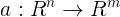

# An implementation of a one-phase interior point method

This package is the implementation of a one-phase interior point method that finds KKT points of optimization problems of the form:
<!--
$$
\min f(x)  \quad \text{s.t.} \quad a(x) \le 0.
$$
-->


where the functions  and  are twice differentiable. The one phase algorithm also handles bound constraints and nonlinear equalities.

Currently, the package is in development. Please let me know if there are any bugs etc. Note that the code is generally significantly slower than Ipopt in terms of raw runtime, particularly on small problems (the iteration count is competitive). However, we recommend trying our one-phase IPM if Ipopt is failing to solve, the problem is very large or might be infeasible.

## How to install


## How to use with JuMP

Here is a simple example where a [JuMP](http://www.juliaopt.org/JuMP.jl/0.18/JuMP) model is passed to the one phase solver

```julia
using OnePhase, JuMP

m = Model()
@variable(m, x >= 0)
@variable(m, y >= 0)
@objective(m, Min, x-y)
@NLconstraint(m, x^2 + y^2 == 1)

it = one_phase_solve(m);
```

If you wish to change the parameters:

```julia
my_pars = Class_parameters()
my_pars.term.tol_opt = 1e-8
it = one_phase_solve(m, my_pars);
```

In future, we intend to add this into JuMP as a solver.

## Example using CUTEst

Install [CUTEst](http://juliasmoothoptimizers.github.io/CUTEst.jl/latest/) then run
```julia
using OnePhase, CUTEst
nlp = CUTEstModel("CHAIN")
iter = one_phase_solve(nlp);
```
